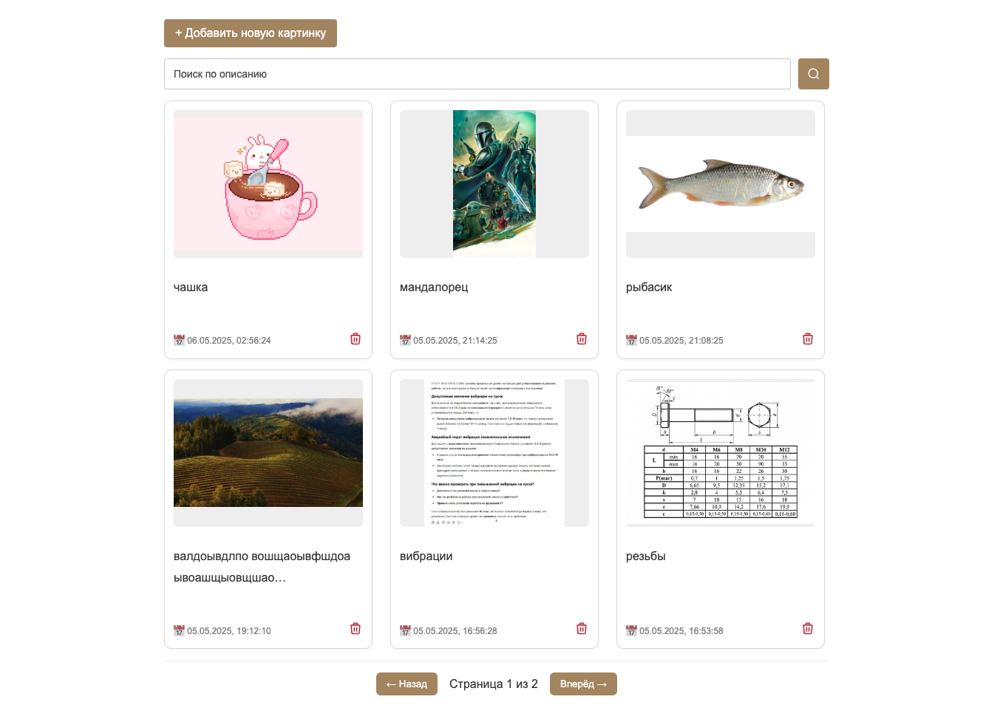
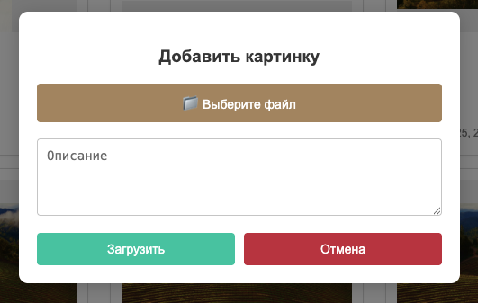
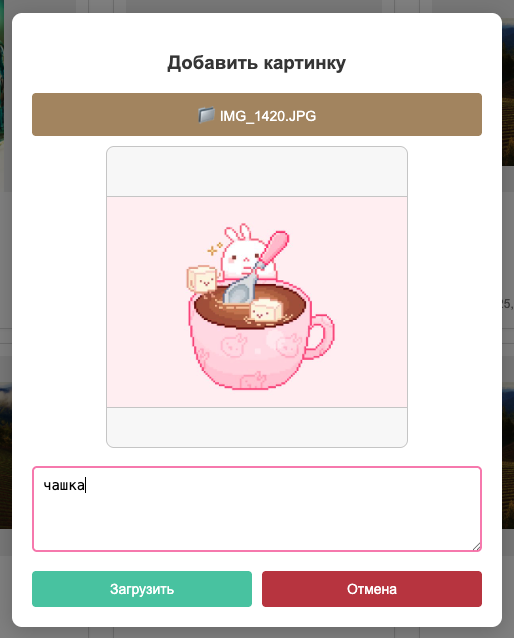
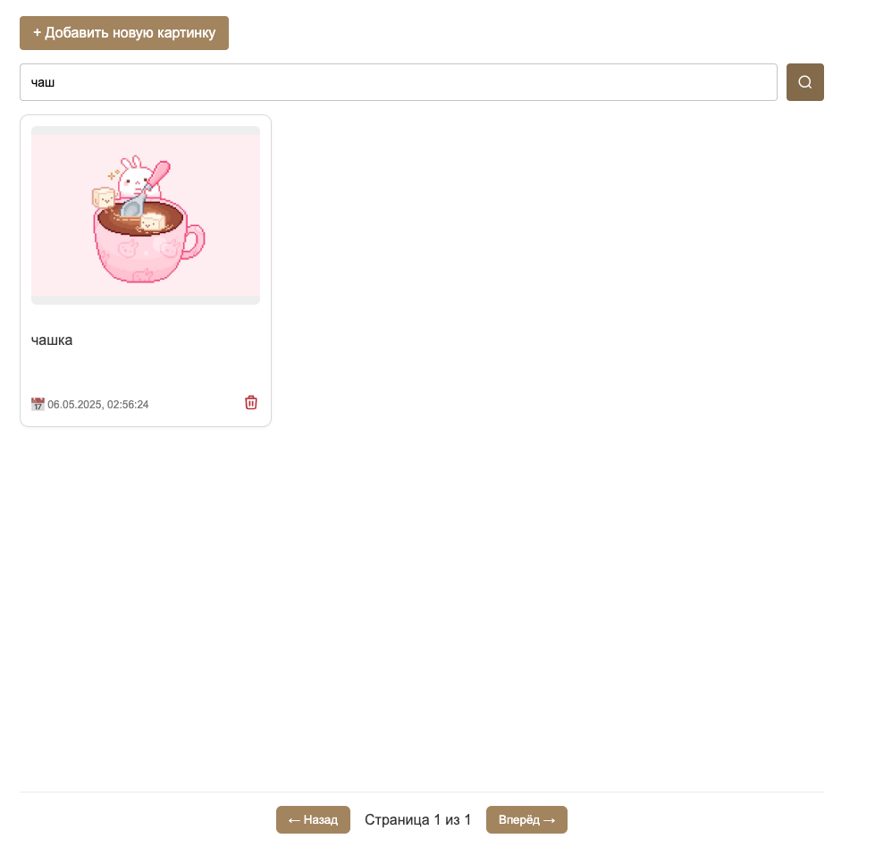
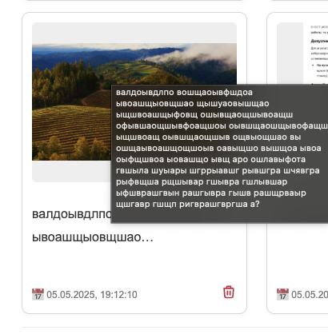
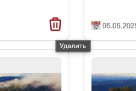

# Pic Service

Веб-приложение для загрузки и отображения изображений с использованием Django REST API и Vue.js.

🔗 [Demo](https://pic-service-frontend-test.up.railway.app/)



## Contacts
- tg: @Westorlean
- +79082734033
- vigsna@mail.ru
- ivanvireykin@gmail.com

## Стек технологий
-  **Backend**: Django 5.2, Django REST Framework
-  **Frontend**: Vue.js
-  **База данных**: MySQL
-  **Хранилище изображений**: Cloudinary
-  **Прочее**:
   - `django-cors-headers` для поддержки CORS
   - `python-dotenv` для управления переменными окружения


## Структура проекта
```
pic-service/
├── backend/ # Django-приложение (API)
├── frontend/ # Vue-приложение
├── requirements.txt
├── manage.py
...
```

## API

**1. POST**  `/upload_image` - Загрузка изображения

**Параметры (multipart/form-data):**
-  `image`: файл изображения
-  `description`: описание изображения
-  `created_at`: дата создания 

**Пример ответа:**
```json
{
    "id": 1,
    "url": "https://res.cloudinary.com/...",
    "description": "Описание",
    "created_at": "2025-05-06T12:00:00Z"
}
```
---

**2. DELETE**  `/delete_image` - Удаление изображения

**Параметры (JSON):**
-  `id`: ID изображения для удаления

---

**3. GET**  `/paginate_images` - Пагинация изображений

**Query параметры:**
-  `page`: номер страницы (по умолчанию 1)
-  `page_size`: количество изображений на странице (по умолчанию 10)

**Пример ответа:**
```json
{
    "count": 42,
    "images": [
        {
            "id": 1,
            "url": "https://res.cloudinary.com/...",
            "description": "Описание",
            "created_at": "2025-05-06T12:00:00Z"
        },
      ...
    ]
}
```

## Images table

| Поле | Тип | Описание |
|--------------|------------------|-----------------------------|
| `image_id` | CharField (PK) | Уникальный идентификатор |
| `image_url` | CharField | URL изображения в Cloudinary |
| `description`| TextField | Описание изображения |
| `created_at` | DateTimeField | Дата создания |

## UI
Приложение предоставляет интуитивный интерфейс для работы с изображениями:

#### Главная страница

#### Добавление (модалка)

#### Предпросмотр картинки

#### Загрузка

#### Фильтрация по описанию

#### Развёрнутое описание

#### Удаление
